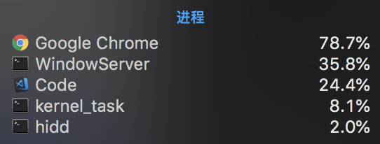
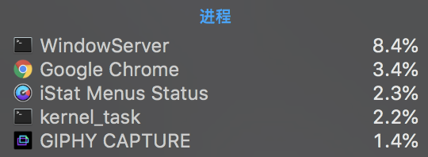

# AngularLoveParticles

### 运行本例

```bash
$ git clone https://github.com/jakechan2012/angular-love-particles.git
$ cd angular-love-particles
$ npm i
$ npm start
```

## 效果


## Angular 使用 particles.js 的注意事项

由于 `particles.js` 使用了全局变量来存储其所用的对象，而 SPA 应用在切换路由时全局变量无法清除，导致 cpu 依然在做着大量的 js 运算。

我们可以为了炫酷的效果牺牲一些性能，但是登录完成后它的任务也就结束了，所以必须销毁它，以免对应用产生性能影响。

### 使用 particles.js 的 cpu 使用情况

  
登录页面 Chrome 的 cpu 占用

  
离开登录页面后 Chrome 的 cpu 占用

### 组件销毁时自动销毁 pJS

```typescript
ngOnDestroy() {
  if (pJSDom && pJSDom.length > 0) {
    // 单页应用的全局对象一直会存在，会产生性能问题
    // 如果存在全局对象则先销毁
    pJSDom[0].pJS.fn.vendors.destroypJS();
    pJSDom = [];
  }
}
```